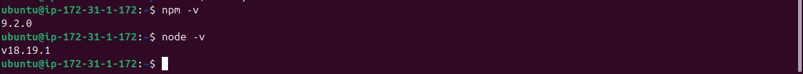
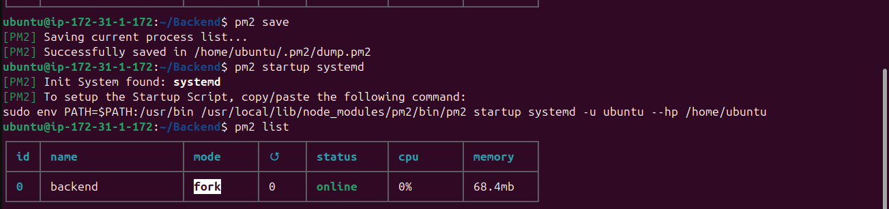
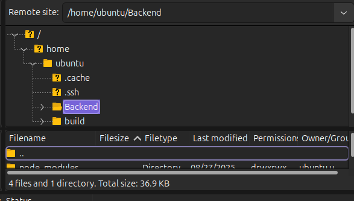
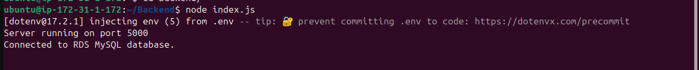

# Deploying Your Full-stack Website: Node.js/Express Backend with RDS Database on AWS EC2

This guide covers the steps to deploy your backend (Node.js with Express) on an EC2 instance, connect it to an AWS RDS database, and serve your full stack app.  
**Screenshots:** Add your own to the `images/` folder and reference them in the relevant steps as shown.

---

## Prerequisites

- AWS account with EC2 and RDS access
- Node.js/Express backend code (already built/tested)
- AWS RDS instance (MySQL/PostgreSQL/other) created and accessible
- Security group rules allowing relevant ports (HTTP/HTTPS/your backend port, DB port)
- Your SSH key pair for EC2
- (Optional) Your React frontend is already deployed
- [Frontend hosting to EC2](../ec2-frontend-hosting/readme.md)

---
## Architectural diagram:
- [Architectural diagram](./images/architectural%20diagram.png)
## 1. Launch/Prepare Your EC2 Instance

1. Launch an EC2 instance (Ubuntu recommended).
2. Open necessary ports in the security group:
    - 22 for SSH
    - 80/443 for HTTP/HTTPS (if serving API publicly)
    - Your backend port (e.g., 4000 or 5000) if different from 80
3. Connect via SSH:
    ```bash
    ssh -i /path/to/your-key.pem ubuntu@<EC2-PUBLIC-IP>
    ```

---

## 2. Install Dependencies

1. Update and install Node.js, npm:
    ```bash
    sudo apt update
    sudo apt install -y nodejs npm 
    ```
    

2. (Optional) Install PM2 for process management:
    ```bash
    sudo npm install -g pm2
    ```
    

---

## 3. Upload/Clone Your Backend Code

- **Option A:** Clone from GitHub
    ```bash
    git clone <your-backend-repo-url>
    cd <your-backend-folder>
    ```
- **Option B:** Use SCP/FileZilla to upload your project directory  
    

---

## 4. Configure Environment and Database

1. **Connection to RDS database:**  
   Make sure your EC2 security group allows outbound access to your RDS instance, and RDS inbound rules allow connections from your EC2's security group.
   
   ### MySQL client
   ```bash
   sudo apt update && sudo apt install mysql-client -y
   mysql -h <rds-endpoint> -u <username> -p
   ```

2. **Edit environment variables:**  
   Create a `.env` file with your DB config and secrets.

---

## 5. Install Node Modules

Navigate into your project folders (frontend and backend if they are separate) and install dependencies:

```bash
# For backend
cd backend
npm install

# For frontend (if not already built)
cd frontend
npm install
npm run build   # only needed for frontend (React, Vue, etc.)
```

---

## 6. Start Your Backend Server

- For production, use PM2:
    ```bash
    pm2 start npm --name "backend" -- start
    pm2 save
    pm2 startup
    ```
- Or, for testing:
    ```bash
    node index.js   # or whatever your main file is
    ```
- Your API should now be running on the specified port!



---

## 7. Reverse Proxy (Optional, Recommended)

If you want to serve your backend via port 80 (standard HTTP), set up a reverse proxy with Nginx or Apache.  
**Example Nginx config:**
```nginx
server {
    listen 80;
    server_name _;

    location / {
        proxy_pass http://localhost:5000;
        proxy_http_version 1.1;
        proxy_set_header Upgrade $http_upgrade;
        proxy_set_header Connection 'upgrade';
        proxy_set_header Host $host;
        proxy_cache_bypass $http_upgrade;
    }
}
```
- Reload Nginx:
    ```bash
    sudo systemctl reload nginx
    ```

---

## 8. Environment and Security Tips

- Never commit your `.env` file or credentials to version control.
- Use strong passwords for your DB.
- Regularly update your server and dependencies.
- Set up firewalls and restrict security groups as much as possible.

---

## 9. Test Your Deployment

- Open your backend API in the browser or with [Postman](https://www.postman.com/).
    ```
    http://<EC2-PUBLIC-IP>:4000/api/your-endpoint
    ```
- Check logs for errors:
    ```bash
    pm2 logs
    ```

---

## 10. Connecting Frontend to Backend

- Point your frontend app’s API calls to your backend’s public domain or EC2 public IP and port.

---

## Adding Screenshots

- Place them in an `images/` directory at the root.
- Reference them in the README as shown (``).

---

## Need Help or Want to Connect?

Connect with me on [LinkedIn](https://www.linkedin.com/in/zahida-parveen-73a446347/).

---

**Happy Deploying!**