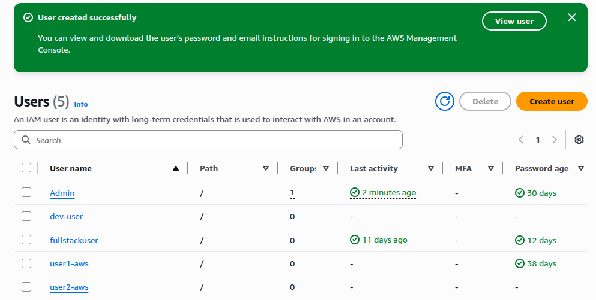
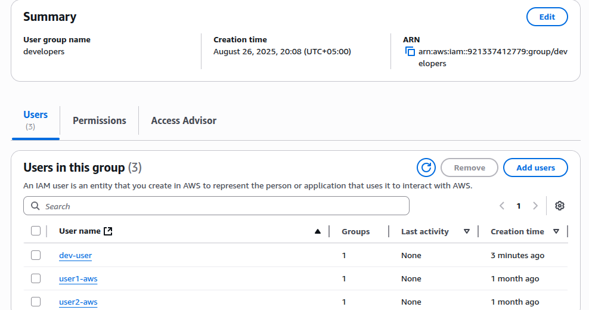
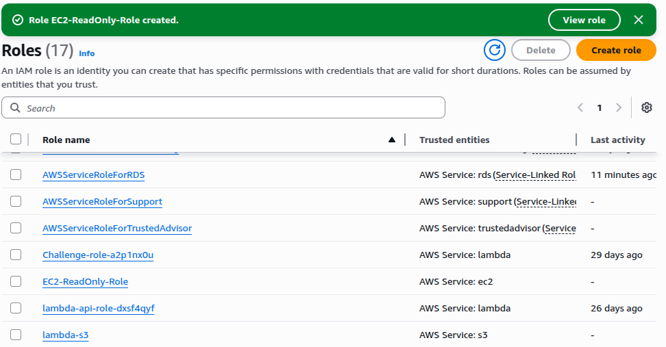

# IAM Users, Groups, and Roles Management

## Overview
This project demonstrates how to create and manage IAM (Identity and Access Management) users, groups, and roles in AWS. By following these steps, you can securely control access to your AWS resources by assigning permissions to users, organizing them into groups, and creating roles for delegated or temporary access.

## AWS Services Used
- AWS IAM (Identity and Access Management)

## Step-by-Step Guide

1. **Create IAM Users**
   - Go to the [AWS IAM Console](https://console.aws.amazon.com/iam/).
   - Click "Users" in the sidebar, then "Add users".
   - Enter a user name (e.g., `dev-user`).
   - Choose AWS access type (console access, programmatic access, or both).
   - Set an initial password if console access is enabled.
   - 

2. **Create IAM Groups**
   - In the IAM Console, click "User groups" then "Create group".
   - Enter a group name (e.g., `Developers`).
   - Attach policies that define the permissions for the group (e.g., `AmazonS3ReadOnlyAccess`).
   - Add users to the group.
   - 

3. **Create IAM Roles**
   - In the IAM Console, click "Roles" then "Create role".
   - Choose the trusted entity (AWS service, another AWS account, or web identity).
   - Attach policies that determine what actions the role can perform.
   - Name the role (e.g., `EC2-ReadOnly-Role`).
   - 

4. **Assign Permissions**
   - Attach policies to users, groups, or roles to grant necessary permissions.
   - For best practices, prefer assigning permissions to groups and roles instead of directly to users.

5. **Test Access**
   - Log in as the IAM user or assume the role to verify that the permissions work as intended.
   - Adjust policies as necessary.

## Result
You have securely set up IAM users, organized them into groups for easier management, and created roles for delegated or temporary access, following AWS best practices for identity and permissions management.

## References
- [AWS IAM Documentation](https://docs.aws.amazon.com/iam/)
- [AWS IAM Console](https://console.aws.amazon.com/iam/)
- [IAM Best Practices](https://docs.aws.amazon.com/IAM/latest/UserGuide/best-practices.html)

---

*Project by [Zahida](https://www.linkedin.com/in/zahida-parveen-73a446347/)*