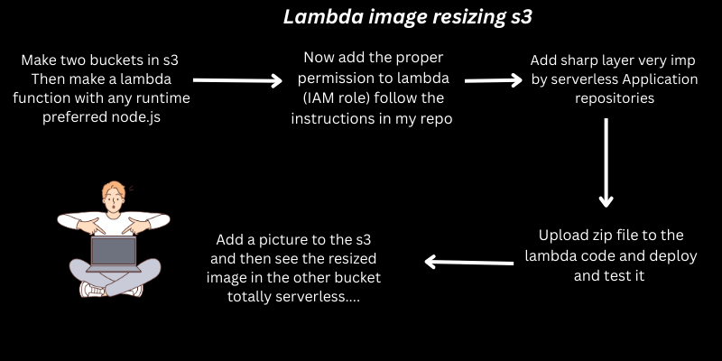
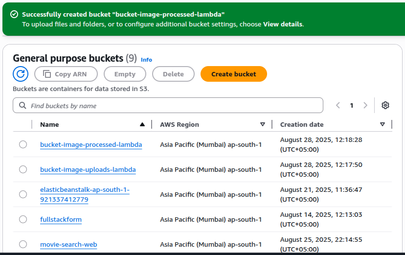
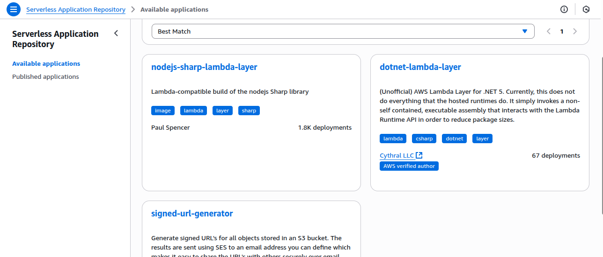
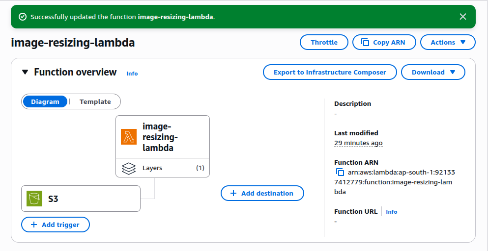
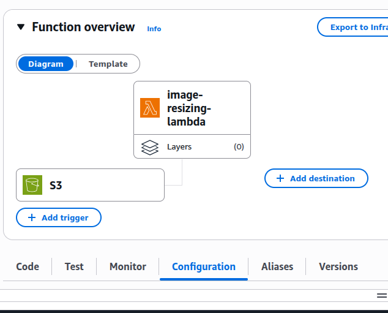

# Serverless Image Resizing with AWS Lambda and S3 (Node.js)

This project demonstrates how to automatically resize images using AWS Lambda and S3, leveraging the Node.js runtime. When a new image is uploaded to a source S3 bucket, the Lambda function is triggered, resizes the image, and stores the resized image in a destination S3 bucket.

---

## Prerequisites

- AWS account with permissions for Lambda and S3
- Node.js knowledge (basic)
- AWS CLI configured (optional for deployment via CLI)
- [Serverless Framework](https://www.serverless.com/) or AWS Console access

---

## Architecture Overview

1. User uploads an image to the **source S3 bucket**.
2. S3 triggers the **Lambda function** (Node.js).
3. Lambda resizes the image (e.g., using [sharp](https://github.com/lovell/sharp)).
4. Lambda uploads the resized image to the **destination S3 bucket**.



---

## 1. S3 Buckets Setup

- Create two buckets (e.g., `my-images-source` and `my-images-resized`).
- Ensure both are in the same AWS region as your Lambda function.



---

## 2. Lambda Function Setup

### A. Dependencies

- Use the Node.js runtime (e.g., Node.js 18.x).
- Make a role that will have permission of s3 and to put logs in cloudwatch.
- To make this  role attach the policies like :

1. s3FullAccess
2. AWSLambdaBasicExecutionRole

## Installation of sharp 
- on your computer run this :
```bash
mkdir lambda-image-resizer
cd lambda-image-resizer
npm init -y
npm install sharp
```
- Add the `sharp` library for image processing.
- Now create index.js in the same directory of lambda-image-resizer


### B. Example Lambda Handler
- Paste this code into your index.js in same directory.
```js
const { S3Client, GetObjectCommand, PutObjectCommand } = require("@aws-sdk/client-s3");
const sharp = require("sharp");

const s3 = new S3Client({}); // region picked from AWS_REGION

exports.handler = async (event) => {
  console.log("Event received:", JSON.stringify(event, null, 2));

  // Guard: ensure it's an S3 event
  if (!event?.Records?.[0]?.s3) {
    console.log("Not an S3 event. Exiting.");
    return { statusCode: 200, body: "No S3 record" };
  }

  const srcBucket = event.Records[0].s3.bucket.name;
  const srcKey = decodeURIComponent(event.Records[0].s3.object.key.replace(/\+/g, " "));
  const destBucket = process.env.DEST_BUCKET;  // must be set in env vars
  const width = parseInt(process.env.RESIZE_WIDTH || "200", 10);
  const outFormat = (process.env.OUTPUT_FORMAT || "jpeg").toLowerCase(); // jpeg|png|webp|avif
  const destKey = replaceExt(`resized-${srcKey}`, `.${outFormat}`);

  if (!destBucket) throw new Error("DEST_BUCKET env var not set");

  // Prevent infinite loops if source == destination bucket
  if (srcBucket === destBucket && srcKey.startsWith("resized-")) {
    console.log("Skipping already-resized object to avoid recursion:", srcKey);
    return { statusCode: 200, body: "Skipped resized object" };
  }

  try {
    // 1) Download
    const getResp = await s3.send(new GetObjectCommand({ Bucket: srcBucket, Key: srcKey }));
    const inputBuffer = await streamToBuffer(getResp.Body);
    console.log(`Downloaded ${srcBucket}/${srcKey} (${inputBuffer.length} bytes)`);

    // 2) Resize
    const resized = await sharp(inputBuffer).resize({ width }).toFormat(outFormat).toBuffer();
    console.log(`Resized to width=${width}, bytes=${resized.length}, format=${outFormat}`);

    // 3) Upload
    await s3.send(new PutObjectCommand({
      Bucket: destBucket,
      Key: destKey,
      Body: resized,
      ContentType: `image/${outFormat}`,
    })
  );
  console.log("Uploading to:", destBucket, destKey, "Size:", resizedImage.length);


    console.log(`✅ Uploaded: s3://${destBucket}/${destKey}`);
    return { statusCode: 200, body: `OK: s3://${destBucket}/${destKey}` };
  } catch (err) {
    console.error("❌ Processing failed:", err);
    throw err;
  }
};

// Stream → Buffer (works across SDK versions / runtimes)
function streamToBuffer(stream) {
  if (stream && typeof stream.transformToByteArray === "function") {
    return stream.transformToByteArray().then((arr) => Buffer.from(arr));
  }
  return new Promise((resolve, reject) => {
    const chunks = [];
    stream.on("data", (c) => chunks.push(c));
    stream.on("end", () => resolve(Buffer.concat(chunks)));
    stream.on("error", reject);
  });
}

function replaceExt(path, newExt) {
  const i = path.lastIndexOf(".");
  return i === -1 ? path + newExt : path.slice(0, i) + newExt;
}

```

---
## 4. ZIP file

- Make zip file by running this in same directory.
```bash
zip -r lambda-image-resizer.zip .

```
- Now add this to the lambda->code->upload .zip file 
- Then you will see the zip file along with node_mudulus etc on the left including  index.js.

---
## 5. Adding layer (recommended) or use docker image

- Go to console -> Serverless Application Repository -> Available applications -> in search bar write : sharp 

- After this click deploy 
- Now in lambda move down you will see layer section click add layer -> custom layer .
- You will see your deployed layer there.


---

## 4. S3 Event Trigger

- In the S3 **source bucket**, configure an event notification for `PUT` operations to trigger your Lambda function or `ALL` if you want it to trigger by any action in s3.

---

## 5. Testing

1. Upload an image (e.g., `photo.jpg`) to your **source S3 bucket**.
2. After a few seconds, check your **destination S3 bucket** for `resized-photo.jpg`.


---
## 6. Adding .zip code to lambda
1. If your file size  is less than or equal to 10mb then do direct uploads.
2. otherwise use s3 upload

## 6. Customization

- Change dimensions in `sharp().resize(width, height)` as needed.
- Adjust content type based on the original image format.

---

## 7. Deployment

You can deploy using:

- **Serverless Framework** (recommended for easy setup and deployment)
- **AWS Console** (manual upload/configuration)
- **AWS SAM or CloudFormation** (for infrastructure as code)

---


## Need Help or Want to Connect?

Connect on [LinkedIn](https://www.linkedin.com/in/zahida-parveen-73a446347/).

---

**Happy Serverless Building!**