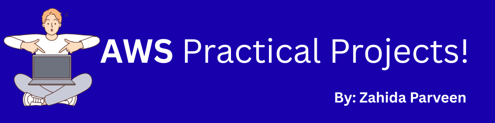

# AWS Practical Projects 🚀

Welcome to my AWS Practical Projects portfolio!  
This repository is a curated collection of hands-on projects built with various AWS services. Each project is designed to demonstrate real-world cloud skills and solutions—from basic setups to creative architectures.

---

## 🌟 Why This Repo?

- **Showcase Practical Skills:** Each project folder contains step-by-step guides, code snippets, and resources for cloud enthusiasts and learners.
- **Learn by Doing:** These projects cover a range of AWS services, offering practical experience beyond theory.
- **Stay Inspired:** My goal is to motivate others to explore, innovate, and level up their cloud skills!

---

## 📂 Projects Included

- [S3 Static Website Hosting](./s3-static-website/README.md)

- *(Add more projects as you grow!)*

---

## 🛠️ AWS Services Covered

- Amazon EC2 (Compute)
- Amazon S3 (Storage)
- AWS Lambda (Serverless)
- IAM, VPC, CloudWatch, and more!

---

## 🚀 How to Use

Click any project above to explore its guide, code, and outcomes.  
Feel free to fork, experiment, or reach out if you have questions!

---

## 👩‍💻 About Me

Hi! I’m Zahida, a cloud enthusiast passionate about building and sharing real-world AWS solutions.  
Let’s connect on [LinkedIn](https://www.linkedin.com/in/zahida-parveen-73a446347/)!

---

*Keep learning, keep building!*
