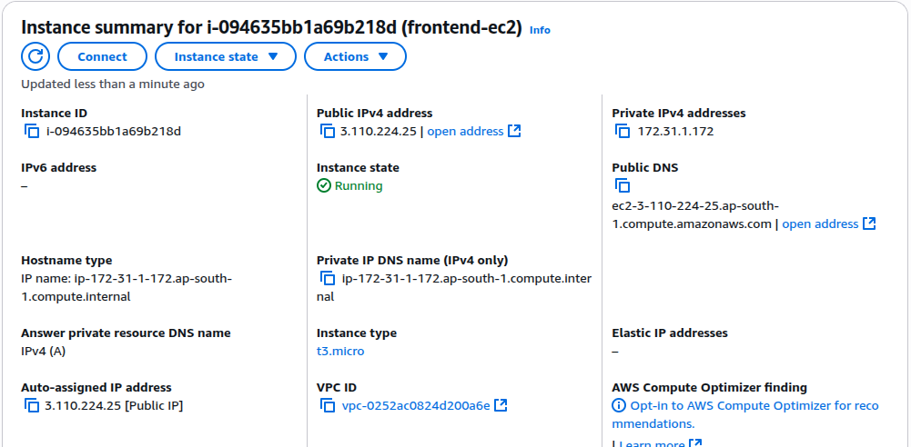
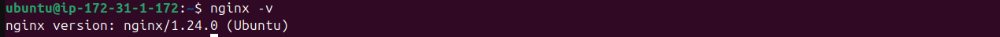
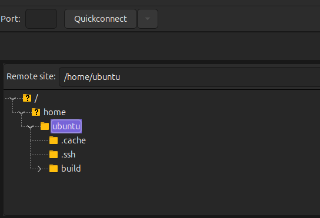
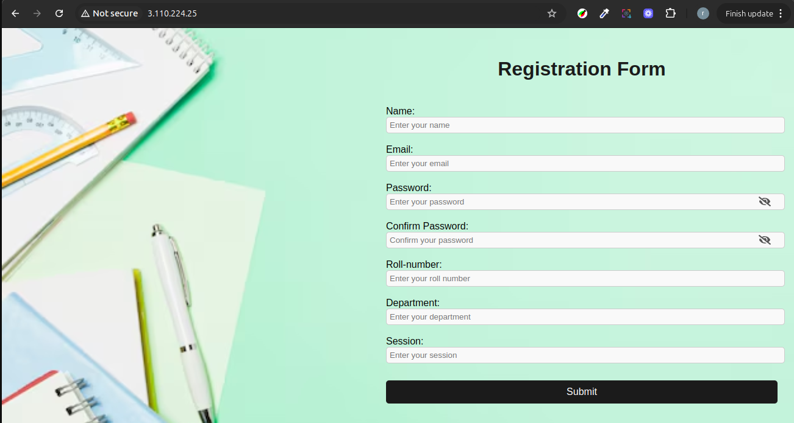

# Hosting Your Frontend on AWS EC2

This guide provides step-by-step instructions for deploying your frontend application to an Amazon EC2 instance, using either **Nginx** or **Apache** as the web server. You’ll also find instructions for uploading files via FileZilla, and all commands are included in both **bash (Linux/Mac)** and **Windows CMD** styles where applicable.

**Now with screenshots for each major step!**

At the end, you can find my LinkedIn for networking or questions!

---

## Prerequisites

- **AWS Account** (with EC2 permissions)
- **Frontend build files** (like `dist` or `build` folder)
- **SSH key pair** for EC2
- **FileZilla** (optional, for file transfer)
- **Basic terminal/command line knowledge**

---

## Steps for Hosting Your Frontend on EC2

### 1. Launch an EC2 Instance

1. Sign in to the AWS Management Console.
2. Go to **EC2** and click **Launch Instance**.
3. Choose an image (e.g., **Ubuntu 22.04 LTS**).
4. Select an instance type (e.g., t2.micro for free tier).
5. Configure instance details as needed.
6. In **Security Group**, allow:
    - **HTTP (port 80)**
    - **SSH (port 22)**
7. Launch and download your `.pem` key pair.
   

---

### 2. Connect to Your Instance

#### **Bash (Linux/Mac):**
```bash
ssh -i /path/to/your-key.pem ubuntu@<EC2-PUBLIC-IP>
```

#### **CMD (Windows):**
If using [Windows 10+ OpenSSH](https://docs.microsoft.com/en-us/windows-server/administration/openssh/openssh_install_firstuse), use:
```cmd
ssh -i C:\path\to\your-key.pem ubuntu@<EC2-PUBLIC-IP>
```
Or use [PuTTY](https://www.putty.org/) with `your-key.ppk`.


---

### 3. Install a Web Server

#### **A. Nginx (Skip if using Apache)**
```bash
sudo apt update
sudo apt install nginx -y
```


#### **B. Apache**
```bash
sudo apt update
sudo apt install apache2 -y
```


---

### 4. Upload Your Frontend Files

#### Option 1: **SCP from Local**

**Bash:**
```bash
scp -i /path/to/your-key.pem -r /path/to/your/build-folder ubuntu@<EC2-PUBLIC-IP>:/home/ubuntu/
```

**CMD (Windows):**
If you have [WinSCP](https://winscp.net/) or use the Windows `scp` command (available in Windows 10+ PowerShell):
```cmd
scp -i C:\path\to\your-key.pem -r C:\path\to\your\build-folder ubuntu@<EC2-PUBLIC-IP>:/home/ubuntu/
```


#### Option 2: **Using FileZilla**

1. Open FileZilla.
2. Go to **Edit → Settings → SFTP**, click **Add key file** and select your `.pem` file.
3. Enter:
    - **Host:** `sftp://<EC2-PUBLIC-IP>`
    - **Username:** `ubuntu`
    - **Port:** `22`
4. Drag and drop your build files/folder to `/home/ubuntu/`.



---

### 5. Serve Your Frontend

#### **A. With Nginx**

1. Move build files to the web root:
    ```bash
    sudo mv ~/your-build-folder/* /var/www/html/
    ```
2. Reload Nginx:
    ```bash
    sudo systemctl reload nginx
    ```


#### **B. With Apache**

1. Move build files to the web root:
    ```bash
    sudo mv ~/your-build-folder/* /var/www/html/
    ```
2. Ensure permissions:
    ```bash
    sudo chown -R www-data:www-data /var/www/html/
    ```
3. Restart Apache:
    ```bash
    sudo systemctl restart apache2
    ```
---

### 6. Access Your Site

Open your browser and navigate to:
```
http://<EC2-PUBLIC-IP>
```


---

## Notes

- Make sure your security group allows inbound HTTP (port 80).
- For React Router or single-page apps, you may need to adjust your server config to redirect all routes to `index.html`.

---

## Where to Put the Screenshots

- Place your screenshots in an `images/` folder at the root of your project (next to this README).
- Reference them using relative paths as shown above.

---

## Need Help or Want to Connect?

Connect with me on [LinkedIn](https://www.linkedin.com/in/zahida-parveen-73a446347/).

---

Happy Hosting!