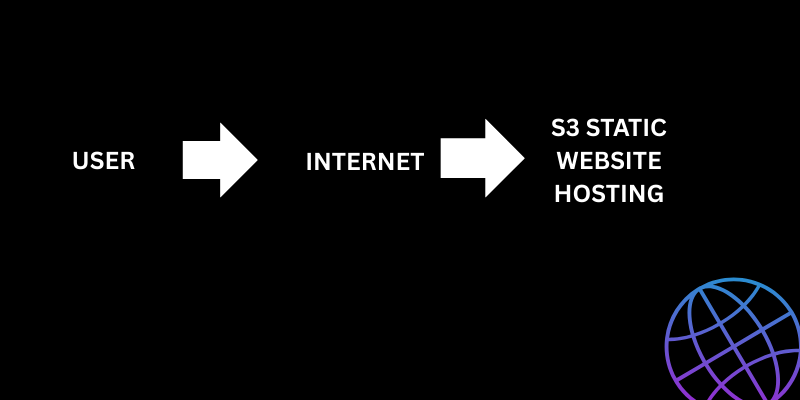
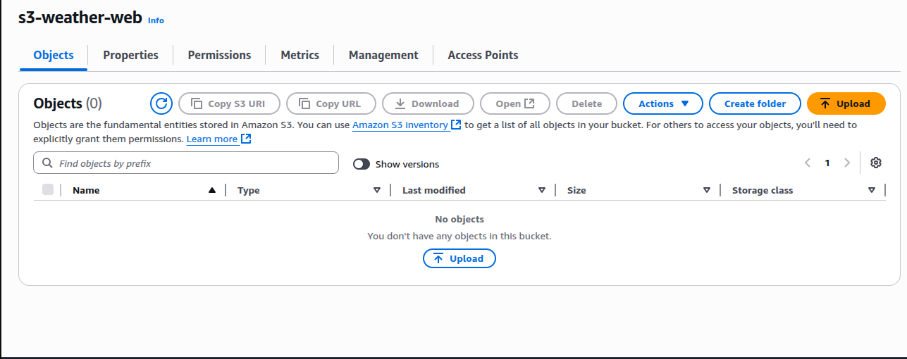
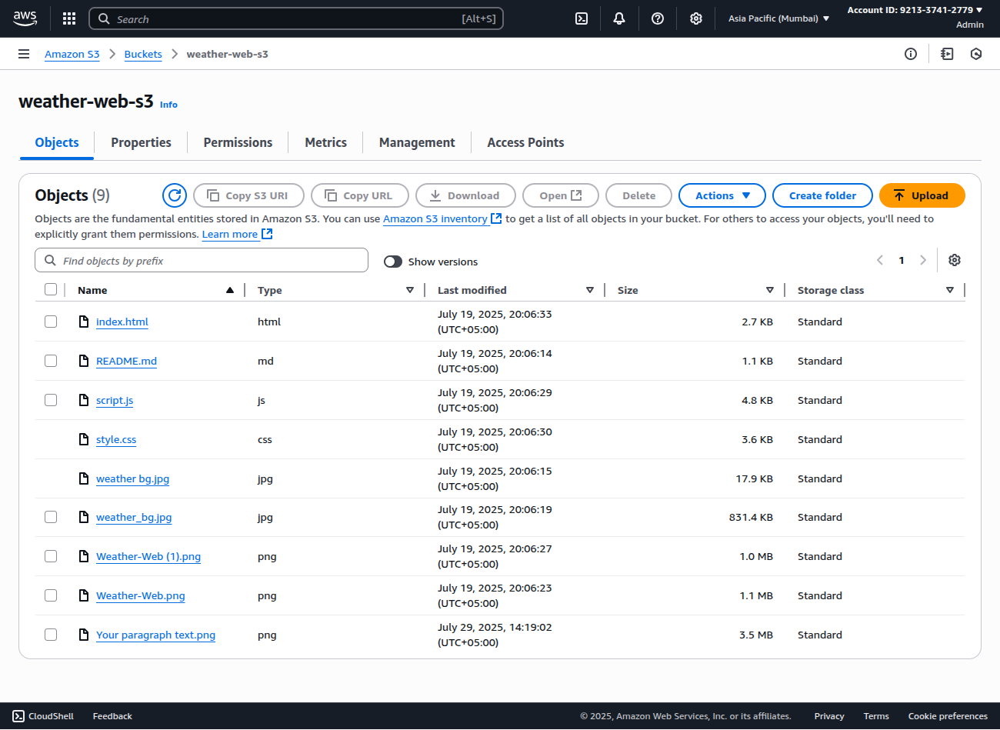
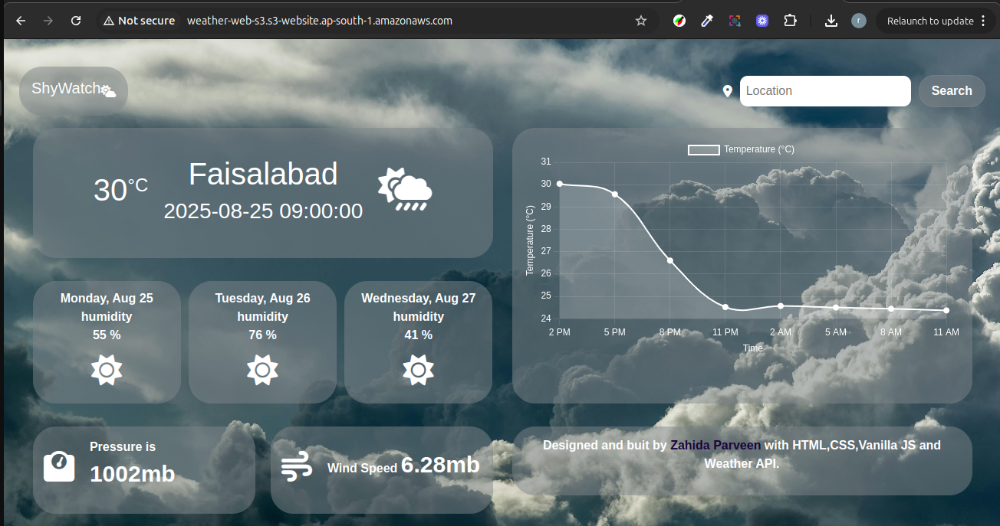

# S3 Static Website Hosting

## Overview
This project demonstrates how to host a static website using Amazon S3. By following these steps, you can deploy HTML, CSS, and JavaScript files directly to an S3 bucket and make your site available on the internet.

## AWS Services Used
- Amazon S3

## Architecture


## Step-by-Step Guide

1. **Create an S3 Bucket**
   - Go to the [AWS S3 Console](https://s3.console.aws.amazon.com/s3/).
   - Click "Create bucket" and set a unique name (e.g., `my-static-website-demo`).
   - Choose a region and leave other settings default.
   - 

2. **Upload Your Website Files**
   - Prepare your static website files (`index.html`, `error.html`, assets, etc.).
   - Upload these files to your S3 bucket.
   - 

3. **Enable Static Website Hosting**
   - Go to the bucket’s "Properties" tab.
   - Scroll down to "Static website hosting" and enable it.
   - Set "index document" (e.g., `index.html`) and "error document" (e.g., `error.html`).
   - Save changes.

4. **Set Bucket Policy for Public Access**
   - Go to the "Permissions" tab.
   - Add a bucket policy to allow public read access. Example:
     ```json
     {
       "Version": "2012-10-17",
       "Statement": [
         {
           "Sid": "PublicReadGetObject",
           "Effect": "Allow",
           "Principal": "*",
           "Action": "s3:GetObject",
           "Resource": "arn:aws:s3:::my-static-website-demo/*"
         }
       ]
     }
     ```
   - Replace `my-static-website-demo` with your bucket name.

5. **Access Your Website**
   - Copy the "Bucket website endpoint" URL.
   - Paste it into your browser to see your static website live!
   - 

## Result
Your static site is now hosted on S3 and accessible via the provided endpoint.

## References
- [Amazon S3 Static Website Hosting](https://docs.aws.amazon.com/AmazonS3/latest/userguide/WebsiteHosting.html)
- [AWS S3 Console](https://s3.console.aws.amazon.com/s3/)

---

*Project by [Zahida](https://www.linkedin.com/in/zahida-parveen-73a446347/)*