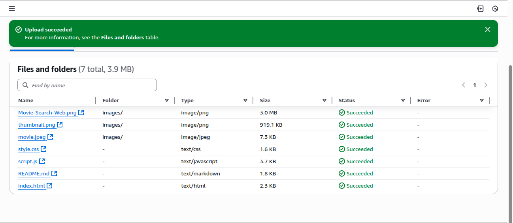
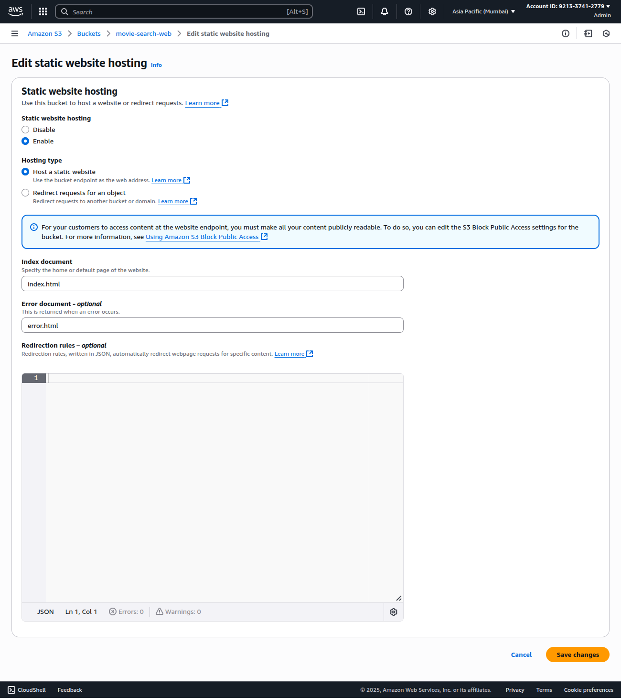
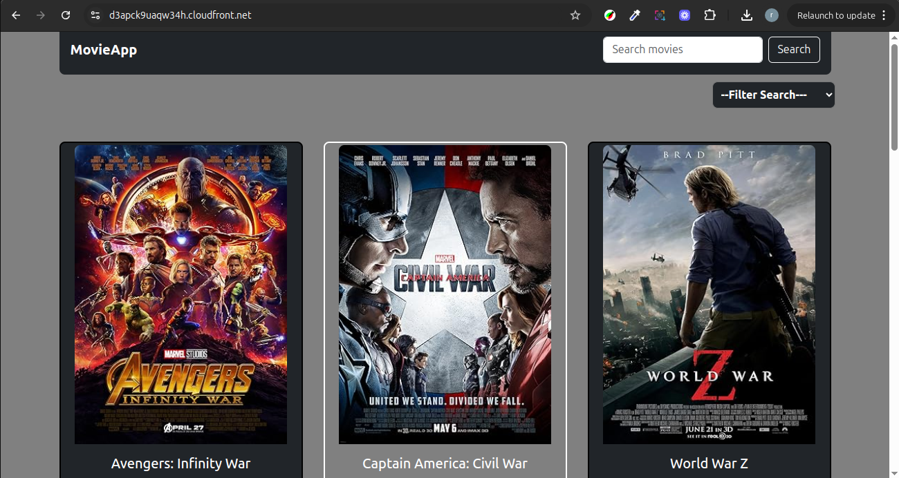

# S3 + CloudFront Static Website Hosting

## Overview
This project demonstrates how to host a static website using Amazon S3 for storage and Amazon CloudFront for global content delivery and HTTPS. By following these steps, you can deploy your site’s HTML, CSS, and JavaScript files to S3, distribute them securely and efficiently using CloudFront, and make your website available worldwide.

## AWS Services Used
- Amazon S3
- Amazon CloudFront

## Step-by-Step Guide

1. **Create an S3 Bucket**
   - Go to the [AWS S3 Console](https://s3.console.aws.amazon.com/s3/).
   - Click "Create bucket" and set a unique name (e.g., `movie-search-web`).
   - Choose a region and leave other settings default.
   - It’s recommended to keep "Block all public access" enabled (CloudFront will handle access).
   - 

2. **Upload Your Website Files**
   - Prepare your static website files (`index.html`, `error.html`, assets, etc.).
   - Upload these files to your S3 bucket.
   - 

3. **Set Up S3 Bucket Permissions**
   - Instead of making the bucket public, you will restrict access to only CloudFront using an Origin Access Control (OAC) or Origin Access Identity (OAI).
   - Go to the "Permissions" tab and ensure public access is blocked.
   - You will configure access in CloudFront in the next step.

4. **Create a CloudFront Distribution**
   - Go to the [CloudFront Console](https://console.aws.amazon.com/cloudfront/).
   - Click "Create Distribution".
   - For the origin, select your S3 bucket.
   - Set up an Origin Access Control (OAC) or OAI so only CloudFront can access your S3 content.
   - Set the default root object (e.g., `index.html`).
   - Enable HTTPS. You can use the default CloudFront certificate, or add your own for a custom domain.
   - 

5. **Update S3 Bucket Policy for CloudFront Access**
   - If using OAI, add a bucket policy to allow CloudFront’s OAI to read objects. Example:
     ```json
     {
  "Version": "2012-10-17",
  "Statement": [
    {
      "Sid": "PublicRead",
      "Effect": "Allow",
      "Principal": "*",
      "Action": "s3:GetObject",
      "Resource": "arn:aws:s3:::weather-web-s3/*"
    }
  ]
  }

     ```
   - Replace `YOUR_OAI_ID` and `my-cloudfront-demo` as appropriate.

6. **(Optional) Set Up a Custom Domain**
   - If you want to use your own domain, request an SSL certificate from [AWS Certificate Manager](https://console.aws.amazon.com/acm/) and attach it to your CloudFront distribution.
   - Update your DNS records (e.g., Route 53) to point to your CloudFront distribution.

7. **Access Your Website**
   - Copy your CloudFront distribution URL (e.g., `https://d1234abcd.cloudfront.net`).
   - Paste it in your browser to see your static website live!
   - 

## Result
Your static site is now hosted on S3, delivered worldwide via CloudFront, and accessible via the CloudFront URL (and custom domain, if configured).

## References
- [Amazon S3 Static Website Hosting](https://docs.aws.amazon.com/AmazonS3/latest/userguide/WebsiteHosting.html)
- [Amazon CloudFront Documentation](https://docs.aws.amazon.com/cloudfront/)
- [AWS Certificate Manager](https://console.aws.amazon.com/acm/)
- [AWS S3 Console](https://s3.console.aws.amazon.com/s3/)
- [AWS CloudFront Console](https://console.aws.amazon.com/cloudfront/)

---

*Project by [Zahida](https://www.linkedin.com/in/zahida-parveen-73a446347/)*